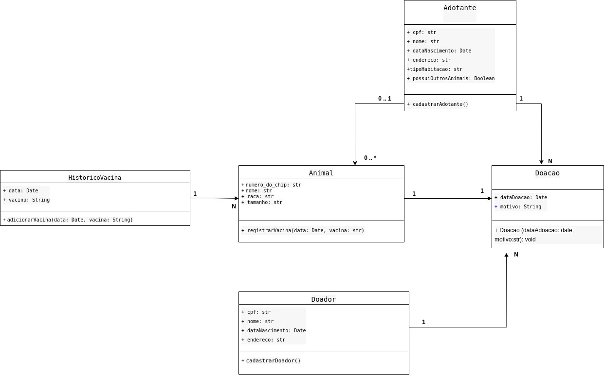

# Projeto de um Sistema de Adoção de Gatos e Cachorros - ONS

    Este projeto foi desenvolvido durante as aulas de Desenvolvimento de Sistemas Orientados a Objetos I (UFSC). 

    O objetivo do sistema é facilitar o processo de adoção de gatos e cachorros.

    Realizado em parceria por Pamela Monteiro e Thabata.
    Implementação em Python. 🐍
    

 

 
 

## Entidades

Objetivo: Garantir a adoção responsável de animais.

- 
<strong> Cadastro de Animais </strong>

    *   Número do chip
    *   Nome
    *   Raça
    *   Tamanho (para cães): Pequeno, Médio, Grande

- 
<strong> Histórico de Vacinação </strong>

    *   Data
    *   Vacina aplicada
    *   Cadastro de Doador

- 
<strong> Registro de Doação </strong>

    *   Data da doação
    *   Animal doado
    *   Doador
    *   Motivo da doação
    *   Cadastro de Adoção

- 
<strong> Adotante </strong>

    *   CPF
    *   Nome
    *   Data de nascimento
    *   Endereço
    *   Tipo de habitação (Casa ou Apartamento)
    *   Possui outros animais (Sim ou Não)

- 
<strong> Processo de Adoção </strong>

    *   Avaliação do perfil
    *   Escolha do animal
    *   Assinatura do termo de responsabilidade

- 
<strong> Registro de Adoção </strong>

    *   Data
    *   Animal adotado
    *   Adotante
    *   Termo de responsabilidade assinado (Sim ou Não)

- 
<strong> Relatórios </strong>
       
    *   Relatório de Adoções
    *   Relatório de Doações
    *   Listagem de Animais Disponíveis para Adoção

## DIAGRAMA UML

<!--  -->

## Relacionamentos

