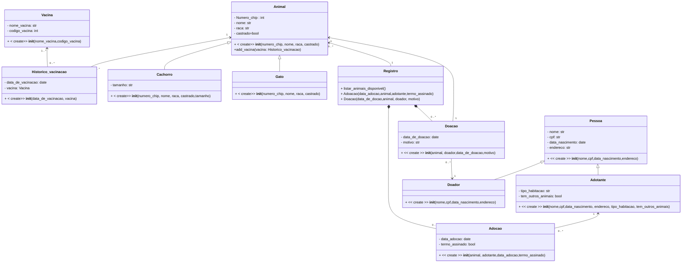
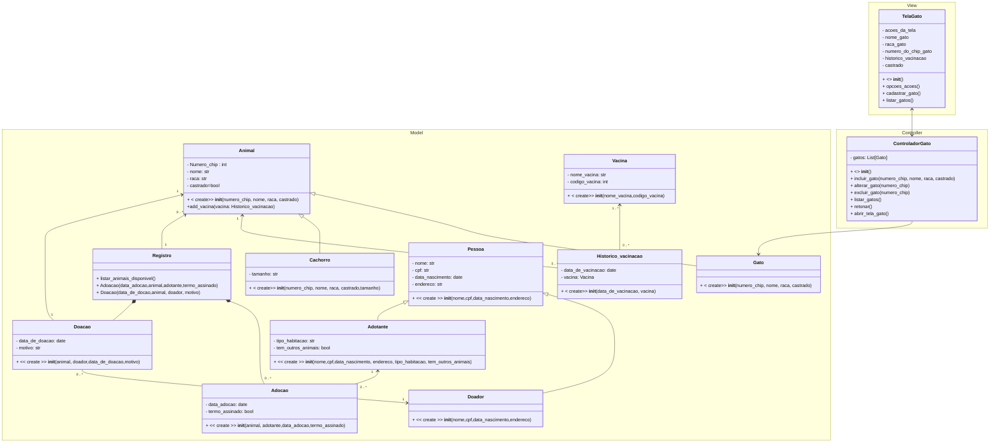

# Projeto de um Sistema de Adoção de Gatos e Cachorros - ONS

 Este projeto foi desenvolvido durante as aulas de Desenvolvimento de Sistemas Orientados a Objetos I (UFSC). 

O objetivo do sistema é facilitar o processo de adoção de gatos e cachorros.

Realizado em parceria por Pamela Monteiro e Thabata.
Implementação em Python. 🐍
    

 
 

## DIAGRAMA UML

#Diagrama de Classe (UML) 
###

## Diagrama de classe seguindo padrão em MVC 
###

